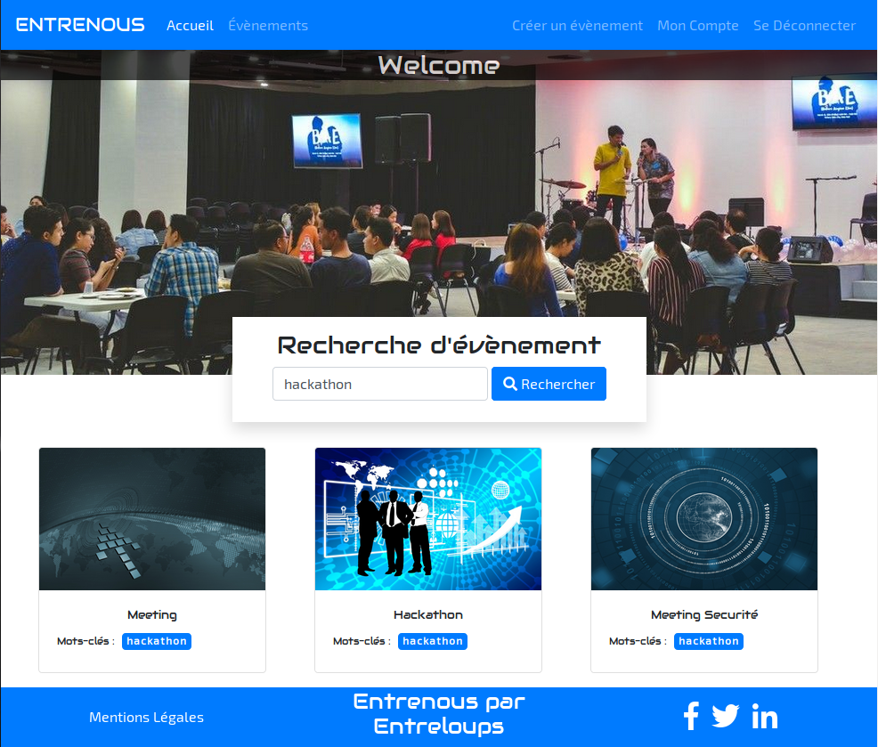

ENTRENOUS par Entreloups
========================

Entrenous is a project created by Steven GRILLON (StevenGrl), Edwin GERARD (EdwinGerard), Arnaud GAUTHIER (Vilcka), 
Xavier MECKLER (xmeckler) and Damien SIDERA (Neimax) under the direction of the WILD CODE SCHOOL started 
on May 15, 2018 and finished on July 6 2018.

Entrenous par Entreloups operates as a website providing membership software, allowing its users to schedule events 
using a common platform.

System requirements
-------------------

* PHP 7.1;

* Web-server (Apache or Nginx);

* Database (MySQL/MariaDB or PostgreSQL);

* composer https://getcomposer.org/doc/00-intro.md

* npm https://www.npmjs.com/get-npm

How To Use
----------

To clone and run this project, you'll need Git, Composer and NPM. From your command line:

**Clone this repository**  
$ git clone https://github.com/WildCodeSchool/orleans-0218-entreloups.git

**Go into the repository**  
$ cd orleans-0218-entreloups

**Install dependencies**  
$ composer install  
$ npm install  

**Initiate Project**
$ php bin/console doctrine:database:create
$ php bin/console doctrine:schema:update --force

**Compile Webpack for CSS and JS**
$ npm run dev (for dev environment)
$ npm run build (for prod environment)

**Launch Server PHP**
$ php bin/console server:run (DEV Only)
$ for prod env, configure a web server (apache, nginx, ...)

**First User Admin**
$ create an account with link "Inscription"
$ check the mail confirmation
$ promote your role admin with the command line:
$ php bin/console fos:user:promote the_username ROLE_ADMIN
$ create yours roles with the url /role

Thx
---
Nicolas VINCENT, Sylvain BLONDEAU, John DEVOS and to all the Wild Code School promo Feb 2018!!!
